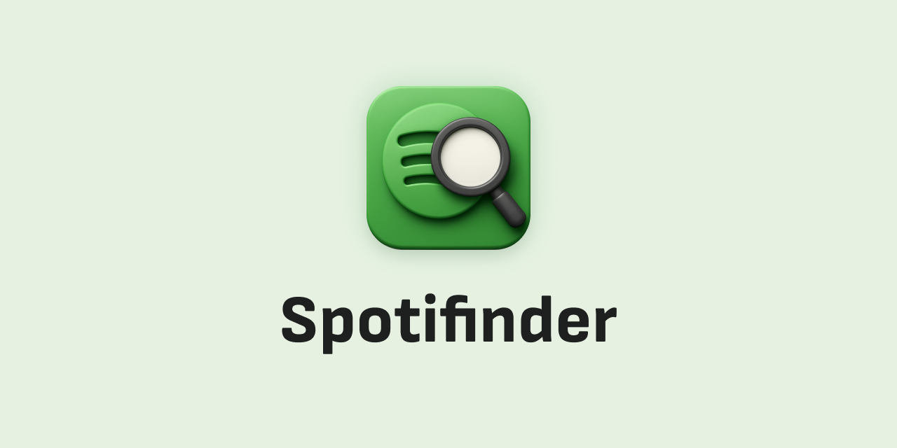

  
  
  # 🎵 Spotifinder
  
  **Transform any text on the web into instant Spotify searches!**

Spotifinder is a Chrome extension that makes it effortless to discover and save your favorite music directly from any webpage. Simply highlight text, search Spotify, and build your music library - all in one seamless flow.

---

## ✨ Key Features

### 🔍 **Instant Search from Any Webpage**
Highlight any text - song titles, artist names, or lyrics - and search Spotify instantly with just one click! Works on blogs, forums, social media, articles, or anywhere on the web.

### ⚡ **Auto-Search Magic**
Once connected to Spotify, searches trigger automatically when you select text. No extra clicks needed - just highlight and go!

### 🤖 **AI-Powered Smart Parsing**
Found a list of songs? Our intelligent parser automatically breaks down multi-line song lists into individual searches, so you can find everything at once. Perfect for:
- Song lists in blog posts
- Playlist recommendations
- Music discovery threads
- Any text with multiple song titles

### 🎯 **Bulk Actions Made Easy**
- **Multi-select tracks** with checkboxes or "Select All"
- **❤️ Like multiple songs** to your library in one click
- **📝 Add selected tracks to playlists** - create new playlists or add to existing ones

### 🔐 **Secure & Private**
- Uses Spotify's official OAuth 2.0 authentication
- All data stays local on your device
- We don't store anything on our servers
- Your privacy is our priority

---

## 🚀 How It Works

1. **Highlight text** on any webpage (song titles, artist names, etc.)
2. **Right-click** and select "Search in Spotifinder" (or click the extension icon)
3. **Browse results** - see all matching tracks from Spotify
4. **Select your favorites** - use checkboxes or click anywhere on a track
5. **Save to your library** - like tracks or add them to playlists, all in one place!

---

## 📸 Screenshots

  
  
  

---

## 📥 Installation

### Install from Chrome Web Store
1. Visit the [Chrome Web Store listing](https://chromewebstore.google.com/detail/spotifinder/agdiikaikbinhhcehkcchpakebphckdk)
2. Click "Add to Chrome"
3. Click the extension icon in your toolbar
4. Click "Connect Spotify" to authenticate
5. Start discovering music! 🎶

### First Time Setup
- You'll need to connect your Spotify account (one-time setup)
- Grant permissions for searching, liking tracks, and managing playlists
- That's it! You're ready to go.

---

## 💡 Use Cases

**Perfect for:**
- 🎧 Music lovers who discover songs on blogs and forums
- 📱 Social media users who want to save songs mentioned in posts
- 📚 Blog readers who want to explore music recommendations
- 🎵 Anyone who wants to quickly build playlists from web content
- 🔍 Music discovery enthusiasts browsing the web

**Example scenarios:**
- Reading a blog post with song recommendations → Highlight the list → Instantly search and save all songs
- Seeing a song title in a Reddit thread → Highlight it → Find it on Spotify and add to your library
- Browsing a music discovery website → Select multiple song titles → Bulk add them to a playlist

---

## 🔒 Privacy & Security

Your privacy matters to us. Spotifinder:
- ✅ Stores all data locally on your device
- ✅ Uses secure OAuth 2.0 authentication
- ✅ Only communicates with Spotify's official API
- ✅ Never transmits your data to third-party servers
- ✅ Open source - you can review the code anytime

**Read our full [Privacy Policy](https://dontpanicgr.github.io/spotifinder-public/privacy-policy.html)**

---

## 🛠️ Support & Feedback

Have questions, found a bug, or want to suggest a feature? We'd love to hear from you! Your feedback helps us make Spotifinder better.

Visit our [GitHub Issues page](https://github.com/dontpanicgr/spotifinder-public/issues)

**Note:** Please check existing issues first to avoid duplicates. If you find a similar issue, you can add your information as a comment instead of creating a new issue.

---

## 🌟 Why Spotifinder?

**The Problem:** You're browsing the web and find amazing song recommendations, but switching between tabs, copying text, opening Spotify, searching, and saving songs is tedious and breaks your flow.

**The Solution:** Spotifinder brings Spotify search directly to wherever you are on the web. One click, instant results, bulk actions - music discovery has never been this smooth.

**The Result:** Turn your browsing into a music discovery adventure! 🎶

---

## 📄 License

This project is open source and available for personal use.

---

**Ready to transform your web browsing into music discovery?** [Get Spotifinder now!](https://chromewebstore.google.com/detail/spotifinder/agdiikaikbinhhcehkcchpakebphckdk)

---

*Made with 🎵 by the Spotifinder team*
